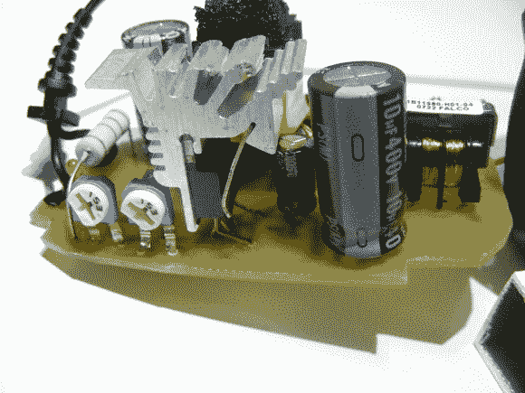

# 用大功率 LED 供电电路改装的壁式电源插座

> 原文：<https://hackaday.com/2013/02/13/wall-wort-retrofitted-with-a-high-power-led-supply-circuit/>

这种定制电路板从壁式电源插座上取下一些部件来驱动大功率 LED 灯。基本概念是保留高压元件，将低压元件换成能够驱动 10W 负载的元件。

PCB 是定制设计的，但你可以看到它的形状与 wall wort 的原板相匹配。右边是原来的 500mA 变压器。低压端使用 LM393，因为它具有双比较器。这为电流和电压提供了反馈，是对 TOP242 的完美补充。我们以前没有见过这种器件，但[Mincior]说这种应用很好，因为它具有安全功能，如果功率或温度超过规格，就会锁定芯片。一旦替换品被放入塑料盒中，它看起来就像库存一样，并确保您定制的 led 灯具能够安全地经受住时间的考验。