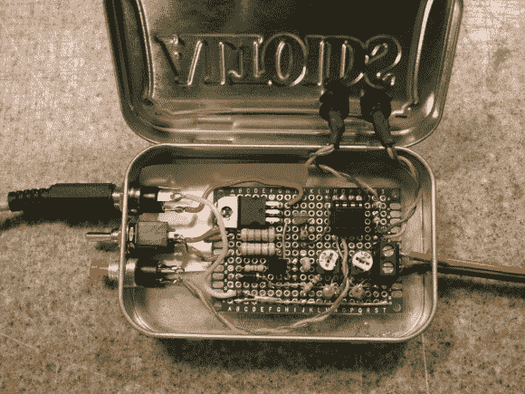

# 555-定时充电铅酸电池

> 原文：<https://hackaday.com/2013/02/14/555-timer-charges-lead-acid-batteries/>

[肯尼斯·芬尼根]把一个伟大设计的焦点重新定位，以解决他自己的问题。这款基于 555 定时器的铅酸电池充电器。这不是一个顶级的，所有的铃铛和口哨类型的充电器。但它用一个现成的 IC 就能完成工作，不需要为微控制器编码。

最初的想法来自参加 555 计时器竞赛的太阳能电池充电器。该应用程序与[Kenneth 的]应用程序之间的主要区别在于来源。太阳能电池阵列或风力涡轮机的发电量有限。但是如果你不注意的话，主电源会产生令人震惊的电流。这里是对电路设计的修改。为了控制这一点，他使用笔记本电脑电源作为中介，只实施传统 3 阶段铅酸充电模式的恒流部分(这些阶段在他的文章中有解释)。

他在当地的广播俱乐部做了一次关于充电器的演讲。休息之后可以看 90 分钟的视频。

[https://www.youtube.com/embed/qypVp3eOuYQ?version=3&rel=1&showsearch=0&showinfo=1&iv_load_policy=1&fs=1&hl=en-US&autohide=2&wmode=transparent](https://www.youtube.com/embed/qypVp3eOuYQ?version=3&rel=1&showsearch=0&showinfo=1&iv_load_policy=1&fs=1&hl=en-US&autohide=2&wmode=transparent)