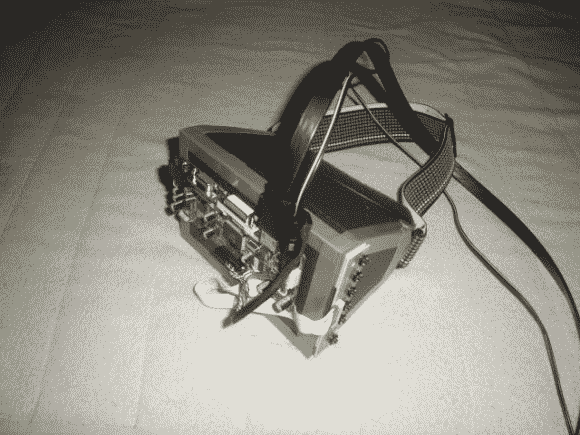
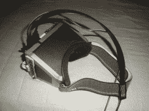
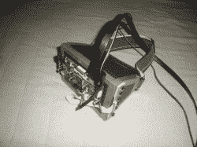
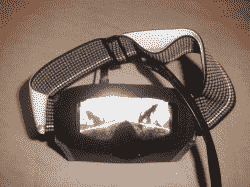

# 你自己的头戴式显示器，只需不到两美元

> 原文：<https://hackaday.com/2013/02/14/your-own-head-mounted-display-for-under-two-bills/>

[D S]想要自己的头戴式显示器。你在这里看到的只是他的模型，但在这个过程中，他意识到这更接近于一个完成的构建，而不仅仅是一个起点。它不仅在游戏中运行良好，而且总价不到 200 美元。你以为你女朋友现在取笑你玩的时候戴着那个大麦克风耳机？等着瞧吧，让她尝尝这个！

休息之后，我们嵌入了一个图库，以及他在电子邮件中发给我们的描述。显示器本身是一个来自易贝的 7 英寸 LCD 模块，分辨率为 1280×800，略高于 720P。他用一副滑雪护目镜把显示器绑在头上。外壳由泡沫板制成，这有助于减轻重量。里面有一个菲涅尔透镜，但在阅读了他如何测量焦距的描述后，我们仍然不能 100%清楚他是如何找到安装它的位置的。

虽然它可能缺少裂缝的 [3d，但一个快速模式可以修复它，他将在前往](http://hackaday.com/2012/09/01/diy-oculus-rift-vr/)[的旅途中顺利建造自己的全息甲板](http://hackaday.com/2013/02/12/university-research-dollars-poured-into-developing-a-holodeck/)。

> 我最近刚刚为我的头戴式显示器项目制作了一个模型，我将在接下来的几个月里完善它。然而，这个模型非常好，所以我想我应该和大家分享一下。
> 
> 这个项目需要的东西:
> 
> 7 英寸 1280×800 分辨率液晶面板，带控制器板和按钮(可从 ebay.com 购买，价格在 100-150 美元之间)
> 
> 滑雪或滑雪板护目镜
> 
> 泡沫塑料芯板
> 
> 明信片大小的塑料菲涅尔透镜(在一些书店有售)
> 
> 塑料或疯狂胶水，双面胶和管道胶带。
> 
> 我想最多总共大约 200 美元。
> 
> 首先，我从护目镜中取出塑料面甲，并以此为参考，将菲涅尔面剪下，放入护目镜中。
> 
> 然后，我打开屏幕电源，并将其插入我的电脑，以确保它能正常工作，并在上面有一张图片来测量焦距，这将是外壳的深度(加上 2-3 毫米，以容纳一些双面胶带来将屏幕安装在外壳内)。
> 
> 然后，我得到了泡沫核心，并削减了五大块的前面，顶部，底部和侧面和两个小三角形的鼻子一块。我使用屏幕和护目镜以及两者之间的理想焦距作为外壳大小和形状的参考(形状会因不同的护目镜、屏幕大小和每个人的眼睛而异，所以我不会详细说明)。
> 
> 我想照片应该能解释剩下的部分。
> 
> 我只花了几个小时就把所有的材料整理好了，戴上它在相当于电影屏幕的屏幕上玩你最喜欢的游戏是非常值得的。
> 
> 我希望你们喜欢它，并有动力自己制作:)