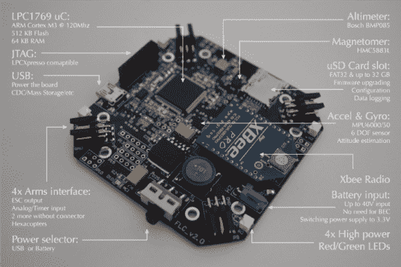

# 四轴飞行器大脑

> 原文：<https://hackaday.com/2013/02/15/quadcopter-brain/>

这个项目是电子工程[Alan Kharsansky]论文的温暖中心。是[四轴飞行器](http://diydrones.com/profiles/blogs/quadrotor-flight-computer)的一体化控制板。这是板的第二次迭代，第一个版本是他自己蚀刻的。正如你所看到的，在休息之后，固件还没有完全准备好。但这并不妨碍我们欣赏他所做的设计选择。

你可以看到他为保持滑板对称所做的努力，这将有助于平衡飞机。PCB 的中心是传感器阵列的宝石，由加速度计和陀螺仪组成。这个位置将有助于减轻设计 PID 算法来驱动四个螺旋桨的麻烦。传感器阵列中还包括一个用于导航的磁力计和一个可用作高度计的气压传感器。有四个多功能连接器用于驱动电机并向电路板提供反馈。他还在电路板上包括了另外两组焊盘(没有自己的连接器)，以防他将来想要添加更多的电机。四轴飞行器可以通过 XBee 模块从基站进行控制。

[https://www.youtube.com/embed/YBPmafMSqKM?version=3&rel=1&showsearch=0&showinfo=1&iv_load_policy=1&fs=1&hl=en-US&autohide=2&wmode=transparent](https://www.youtube.com/embed/YBPmafMSqKM?version=3&rel=1&showsearch=0&showinfo=1&iv_load_policy=1&fs=1&hl=en-US&autohide=2&wmode=transparent)