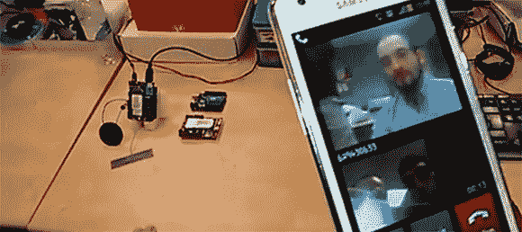

# 可视电话 Arduino 盾

> 原文：<https://hackaday.com/2013/02/20/video-phone-arduino-shield/>

我们已经看到了基于 Arduino 的 Twitter 机器，甚至一些可以发送文本消息的机器，但是一个视频电话怎么样呢？这就是 Cooking Hacks 的家伙们用他们令人印象深刻的 [3G Arduino 盾](http://www.cooking-hacks.com/index.php/documentation/tutorials/arduino-3g-gprs-gsm-gps\)放在一起的东西。

盾牌上有一个内部 GPS 接收器，麦克风，扬声器，3G 模块和一个 VGA 分辨率的摄像头传感器。3G 模块能够通过 USB 连接充当 3G 调制解调器，允许任何计算机通过 SIM 卡利用无线互联网。

虽然在他们的教程中，这些人使用运行在他们电脑上的终端发送 AT 命令来拨打电话，但也可以简单地将所有信息放在草图中，制作一个小型的电池供电的视频链接，直接连接到你的手机。看起来是机器人无线 3G 视频传输的完美硬件。休息过后，你可以看看他们教程中的视频。

[https://www.youtube.com/embed/zwVgMdtKpYU?version=3&rel=1&showsearch=0&showinfo=1&iv_load_policy=1&fs=1&hl=en-US&autohide=2&wmode=transparent](https://www.youtube.com/embed/zwVgMdtKpYU?version=3&rel=1&showsearch=0&showinfo=1&iv_load_policy=1&fs=1&hl=en-US&autohide=2&wmode=transparent)