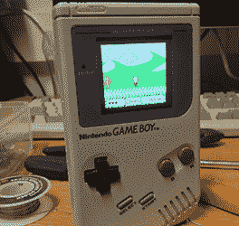

# 一个砖头大小的游戏男孩前进 SP

> 原文：<https://hackaday.com/2013/02/20/a-brick-sized-game-boy-advance-sp/>

几年来，[迈克尔]一直想把 Game Boy Advance 的精髓——带背光 LCD 的小翻盖版——融入经典舒适的 DMG-01“砖块”游戏机。他终于完成了他的项目，我们不得不说它看起来相当不错。

建造开始时，从一个老蛤壳游戏男孩前进的背光液晶显示器，并热粘合到一个老 DMG-01 的屏幕挡板。最初的“砖块”游戏男孩的墨盒插槽仍然存在，但这个设计决定确实需要相当多的焊接和一段带状电缆。

由于[迈克尔]使用的是在最初的 Game Boy 中找到的原始墨盒插槽，他不能在更小的 Game Boy Advance 墨盒格式中玩任何游戏。不过，应该有可能建立一个适配器，以适应较大的游戏机内的较小的墨盒，他可以随时玩俄罗斯方块和小声音 DJ，所以没有任何有价值的东西丢失。