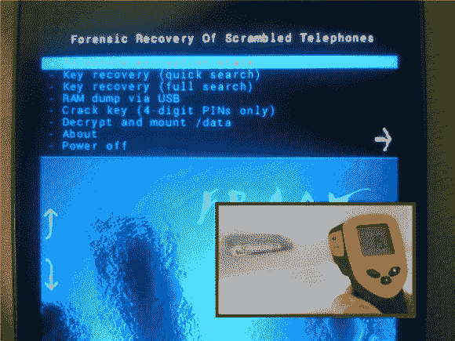

# 冷冻安卓系统来破解加密

> 原文：<https://hackaday.com/2013/02/20/freezing-android-to-crack-the-encryption/>

造一把更好的锁，有人会做一个不用钥匙就能打开的工具。或者在这种情况下，他们制作了一个工具，通过深度冷冻来找到钥匙。加扰电话的取证恢复-或霜冻-使用低温和自定义恢复图像来破解 Android 加密密钥。

冷启动黑客可以追溯到很久以前。它们利用低温来降低设备中 RAM 的速度。在这种情况下，目标电话必须已经开机。启动使用安卓 4.0 和更新版本提供的[加密技术的手机需要机主的密码来解密用户分区。但是在下一次供电周期之前，它仍然是可用的。通过冻结手机，然后非常快速地断开和重新连接电池，研究人员能够在不从 RAM 中清除加密密钥的情况下刷新他们自己的恢复图像。正如您在上面看到，恢复包可以用几种不同的方式来探听密钥。](http://support.google.com/android/bin/answer.py?hl=en&answer=1663755)

[谢谢罗伯]