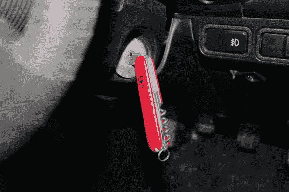

# 瑞士陆军钥匙

> 原文：<https://hackaday.com/2013/02/21/swiss-army-keys/>

这不是一个告诉你如何不用钥匙发动汽车的黑客。这是抛弃笨重钥匙圈的一种方式，取而代之的是一套折叠式钥匙。[上校嘎吱]从小刀上取下刀片，换上他汽车的两把钥匙(一把是点火和门锁，另一把是打开后备箱)。他没有拍下这个过程，但是他链接到了[这个不相关的指南上。](http://www.youtube.com/watch?v=Mi2PUApcPwU)

休息后大约一分钟，我们看到了构建过程中的每一步。首先，从刀的两侧取下塑料边。叶片基本上是铆接的；有一个销子把它们固定住，它的两边被压住，不能再穿过框架上的孔。为了绕过这个，用旋转工具磨掉一边，然后用锤子敲出销。被移除的刀片/剪刀/工具被用作模板来将钥匙的主体切割成一定的尺寸和形状。然后，在装回塑料装饰之前，用锤子将别针敲回原位。

[https://www.youtube.com/embed/Mi2PUApcPwU?version=3&rel=1&showsearch=0&showinfo=1&iv_load_policy=1&fs=1&hl=en-US&autohide=2&wmode=transparent](https://www.youtube.com/embed/Mi2PUApcPwU?version=3&rel=1&showsearch=0&showinfo=1&iv_load_policy=1&fs=1&hl=en-US&autohide=2&wmode=transparent)

[via [Reddit](http://www.reddit.com/r/somethingimade/comments/18tp3j/i_put_my_car_keys_into_a_broken_penknife_because/)