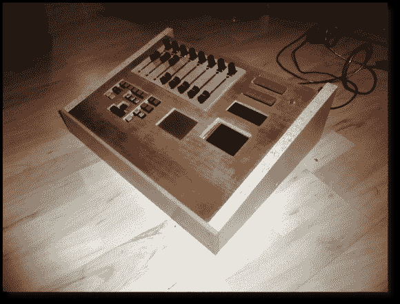

# Arduino 控制的 MIDI 音序器

> 原文：<https://hackaday.com/2013/02/22/arduino-controlled-midi-sequencer/>

[克里斯蒂安]来信告诉我们他的第三代 Arduino MIDI 音序器([翻译为](http://translate.google.com/translate?sl=auto&tl=en&js=n&prev=_t&hl=en&ie=UTF-8&eotf=1&u=http%3A%2F%2Farduinoprx.de%2Findex.php%3Fpage%3D4%26obj%3D30))am 808 VX3。在他之前的版本中，他已经为这个项目打下了坚实的基础。但是用户界面有时仍然令人沮丧，这就是这个版本出现的原因。它有一个漂亮干净的仪表板一样的界面，但也包括一个可配置的虚拟界面。

上面看到的明显组件包括滑块和电位计带，以及安装在它下面的按钮库。但是在板的中央是一个触摸板，它是[Christian]从一台旧笔记本电脑中取出来的。它作为一个 PS2 设备接口，这使得它与 Arduino 结合使用非常简单。但这不是唯一的触摸输入设备。触摸板右侧的矩形是一个带有触摸覆盖层的 LCD 屏幕。正如你在休息后的片段中看到的(和听到的)，触摸屏使他有可能重新设计控件，直到它们变得简单直观。

[https://www.youtube.com/embed/MPI2pU0Ak1k?version=3&rel=1&showsearch=0&showinfo=1&iv_load_policy=1&fs=1&hl=en-US&autohide=2&wmode=transparent](https://www.youtube.com/embed/MPI2pU0Ak1k?version=3&rel=1&showsearch=0&showinfo=1&iv_load_policy=1&fs=1&hl=en-US&autohide=2&wmode=transparent)