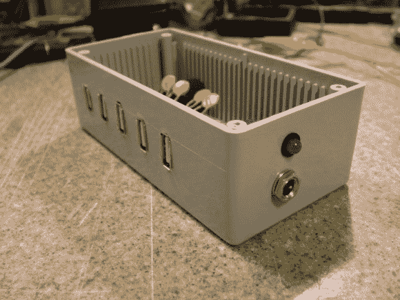

# 构建您自己的哑 USB 电源板

> 原文：<https://hackaday.com/2013/02/22/build-your-own-dumb-usb-power-strip/>

这是[肯尼斯·芬尼根]用他垃圾箱里的零件建造的 USB 充电中心。我们想重申我们的主张，他一定有最神奇的垃圾箱(我们最后看到他拿出的是[一个 24 端口管理以太网交换机](http://hackaday.com/2013/02/15/cracking-open-a-24-port-switch-so-you-dont-have-to/))。

侧面的插孔接受来自 12V 壁式电源插座的筒式连接器。[Kenneth]提到 2.1 毫米插孔是他在所有项目中使用的标准。内部有一个开关模式电源，为每个 USB 端口提供稳定的 5V 电压。我们真的很喜欢他增加了一些保护；如果你最终油炸了你心爱的几百美元的设备，diy 就没有意思了。黄色组件是多保险丝，如果超过 600 mA 的电流，就会切断电源。这对于他的几乎所有设备都很有效，但他的 iPod 4G 不喜欢这个系统。它看到电压下降了一点点，就完全停止充电。