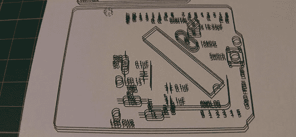

# 为 PCB 制造改装打印机

> 原文：<https://hackaday.com/2013/02/25/modifying-a-printer-for-pcb-fabbing/>

上面这张引发偏头痛的图片是[鲁珀特·赫斯特]尝试在家中制作 PCB 的产物。他使用的是墨粉转移法——用激光打印机在一张透明纸上打印电路，将其放置在一张覆铜板上，然后将整个组件通过层压机。这是一个相当简单的过程，但是如果你不能在打印机上多次打印透明胶片，你的蚀刻保护层就不会保持得太好。当然，透明胶片每次通过打印机时都必须对齐，所以[Rupert] [想出了一个修改方案](http://runawaybrainz.blogspot.co.uk/2013/02/guide-samsung-ml-2165-toner-transfer.html)，确保激光碳粉只到达它应该去的地方。

[Rupert]为他的 PCB 工厂购买了一台 Samsung ML-2165W 激光打印机，但是在同一张透明胶片上多次打印相同的图像会导致掩模无法使用。这个问题是用一些用来悬挂门框的塑料垫片和一个卡片托盘解决的，该托盘确保透明胶片每次都以相同的方式通过打印机。

几周前，当他送来他的六通道软驱 MIDI synth 时，我们看到了他自制的 PCB 制作过程。在他的[制作视频](http://www.youtube.com/watch?feature=player_embedded&v=IYQWLlBz8hE)中，【鲁伯特】展示了迄今为止我们所见过的可能是最干净的墨粉转移 PCB。你可以在休息后的视频中查看他的蚀刻过程。

[https://www.youtube.com/embed/IYQWLlBz8hE?version=3&rel=1&showsearch=0&showinfo=1&iv_load_policy=1&fs=1&hl=en-US&autohide=2&wmode=transparent](https://www.youtube.com/embed/IYQWLlBz8hE?version=3&rel=1&showsearch=0&showinfo=1&iv_load_policy=1&fs=1&hl=en-US&autohide=2&wmode=transparent)