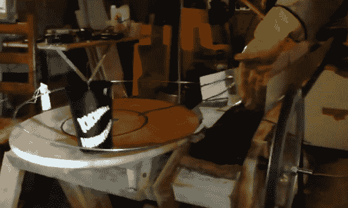

# 自动啤酒灌装机是由各种东西拼凑而成的

> 原文：<https://hackaday.com/2013/02/25/automatic-beer-pourer-was-hacked-together-from-a-bit-of-everything/>

这个东西真的很了不起。这是一个自动灌装啤酒并分发给派对客人的系统。这种方式对政党来说是一场工业革命。漏斗把杯子送到龙头；一旦装满，它们就会被传送带系统送到口渴的客人手中。

许多零件来自该团队为建造而废弃的洗衣机——最明显的是驱动皮带的马达。但是几乎它的每一部分都被回收了。例如，运输完整玻璃杯的传送带是由自行车内胎的粘合部分制成的。为了便于将杯子从灌装站转移到传送带上，一系列非常长的扎带被连接到一根柱子上。当手臂将杯子推到传送带上时，这些带子的尾部就像刷子一样稳定杯子。观看这一切的最佳方式是观看跳转后嵌入的整个剪辑。

[https://www.youtube.com/embed/paBYsWUYVE0?version=3&rel=1&showsearch=0&showinfo=1&iv_load_policy=1&fs=1&hl=en-US&autohide=2&wmode=transparent](https://www.youtube.com/embed/paBYsWUYVE0?version=3&rel=1&showsearch=0&showinfo=1&iv_load_policy=1&fs=1&hl=en-US&autohide=2&wmode=transparent)