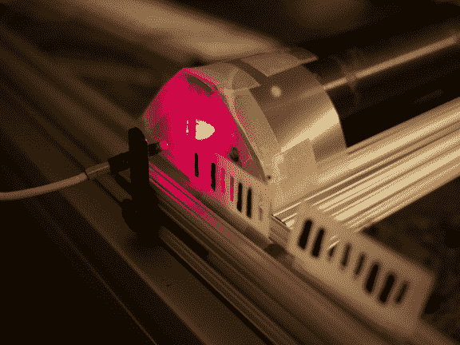

# 当地学校家庭科学之夜的光学数据传输项目

> 原文：<https://hackaday.com/2013/02/28/optical-data-transfer-project-at-local-schools-family-science-night/>

[Dave]想在家庭科学之夜展示他四年级儿子学校的一个项目。我们以前从未听说过这样的活动，但这听起来是个绝妙的主意！他有一个新的激光器，他想把它包括在这个项目中，并注意到他的儿子正在学习 ASCII 如何将字母映射成二进制数，这时他有了这个想法。他最终建立了一个展示二进制代码的光学数据传输系统。

这提供了一个极好的学习机会，因为该项目邀请学校的孩子们选择像上面看到的编码条来形成一个秘密信息。激光指向一个光电传感器，该传感器由一个 Raspberry Pi 板读取。Python 代码寻找基线，然后记录强度的增加和减少。由于半透明的标记具有用于 0 和 1 的孔或黑线，基线方法不需要记录数据。[Dave]报告说，每个参加实验的人都全神贯注于将胶带推过传感器，并在监视器上看到他们的秘密信息。

在阅读了关于使用 LCD 屏幕和光电传感器进行数据传输的[后，他有了写这个项目的动机。](http://hackaday.com/2013/02/25/using-a-flashing-lcd-monitor-to-transfer-data)