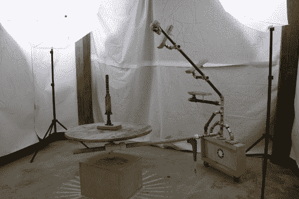

# 旋转摄像头有助于捕捉 3D 视频游戏资产

> 原文：<https://hackaday.com/2013/03/01/revolving-camera-mount-helps-to-capture-3d-video-game-assests/>

这里有一个相机装备，它可以很容易地产生一个物体的真实感三维模型。它是由一家名为骷髅剧院的独立游戏公司以相当低廉的价格制作的。他们发布了几个帖子，展示了[钻机是如何建造的](http://skulltheatre.wordpress.com/2012/10/10/improvements-to-the-camera-rig/)和[如何用来捕捉模型的](http://skulltheatre.wordpress.com/2012/09/13/where-the-magic-happens-2/)。

他们使用的是 123D，这是一个非常流行的数字化物品的软件套件。该装备有一个放置对象的中心桌子，以及一个可移动的夹具，该夹具容纳三个不同的相机(或者一个相机用于三次旋转)。你可以看到地板上的胶带，它标记了每个镜头的位置。这些位置在软件中被绘制出来，因此很容易将它们放在一起。连接夹具和底座的轴是可调节的，以适应大的或小的物品。

我们发现有趣的一件事是团队处理反射的技术。他们使用哑光喷雾来减少这些表面的反光。这有助于 123D 完成它的工作，但也允许他们使用游戏引擎更准确地映射反射表面。