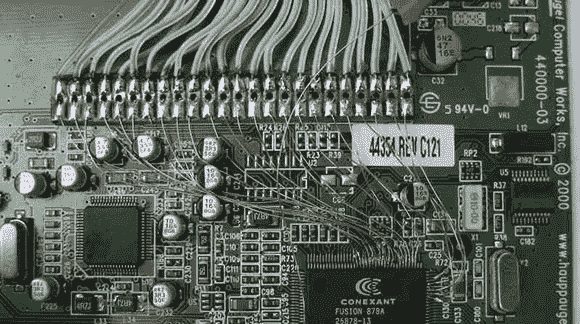

# PCI 卡上的 24 端口 GPIO

> 原文：<https://hackaday.com/2013/03/02/24-port-gpio-on-a-pci-card/>

因此，您有一个在 x86 主板上运行的项目，您需要一些 GPIO 引脚。无论你是想读几个按钮，点亮几个发光二极管，在你的电脑里放一个加速度计还是什么，你都有一个问题。幸运的是[有一种简单的方法可以在 x86 主板上获得 24 个 GPIO 引脚](http://bues.ch/cms/unmaintained/btgpio.html#how_to_physically_access_the_gpio_pins),只需几美元。

构建的关键组件是 Hauppague 以 WinTV 品牌制造的 PCI 电视调谐卡。如果你有一个 Brooktree bt848、bt849、bt878 或 bt879 视频捕获芯片的卡，有 24 个 GPIO 引脚只是一卷磁线、一个烙铁和一个稳定的手。

如果您想要一些 GPIO 操作，而不需要通过通常的并行端口，这是一个很好的构建，特别有用，因为这些 WinTV 采集卡可以从通常的互联网供应商那里只需几美元。当然，您需要一个驱动程序，但是相关的 Linux 内核驱动程序——Bt 8 xxgpio——应该包含在任何合理的现代发行版中。

特别感谢[Dex Hamilton]通知我们这个版本。