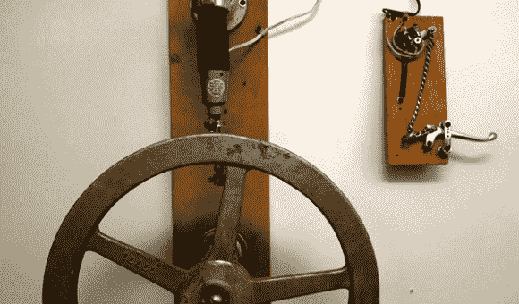

# 赏心悦目的机电门铃

> 原文：<https://hackaday.com/2013/03/05/viscerally-pleasing-electromechanical-doorbell/>

当然，我们可以在这个门铃上贴上蒸汽朋克的标签，但是我们认为这样会降低它的价值。这个装置结合了[水银开关和创造性的机械装置，形成了一个门铃](http://blog.makezine.com/2013/02/27/mercury-switch-doorbell/)。我们认为它超越了美学范畴，从你家的前门开始，你就是一个声明。难怪这些年来[Nick Normal]一直带着它从一家搬到另一家。

右边的部分是振铃器本身。拉动控制杆会使链条穿过一个小孔，从而影响安装在上方的水银开关。该开关接通驱动“铃”装置上马达的电路。我们使用引号，因为它不是敲响钟声，而是敲击大型阀门控制轮，看起来像是直接来自同一个工厂，小丑在那里不幸跌入酸缸。

这当然给了你一些渴望的东西。如果你认为你已经在类似的极客基础上实现了门铃设置[为什么不告诉我们呢](http://hackaday.com/contact-hack-a-day/)？