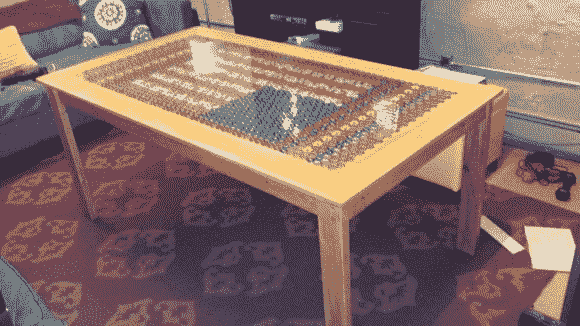

# 临时搭建的瓶盖咖啡桌随着音乐跳动

> 原文：<https://hackaday.com/2013/03/06/scratch-built-bottle-cap-coffee-table-pulses-to-the-music/>

这不是旧货店的咖啡桌被改装成工艺品。[Dandujmich] [使用框架木材、瓶盖、塑料树脂和一些用于装饰的电子设备，从头开始建造它。](http://imgur.com/a/Wjvlk)

第一步是看看他手头是否有足够的资金来完成这个项目。仅仅看着它很难掌握有多少被使用，但是画廊的描述告诉我们大约有 1700 个被用在了设计中！他从那里抓了一些 2x4 开始建造。桌子腿从两个端部组件开始，通过用销钉将腿固定到端部横梁上来构建。从那里，他在侧轨上切下一只兔子，并从内部将它们拧到腿组件上。

桌面包括具有足够深的凹陷区域的框架，以将盖子保持在表面以下。在花了大约 10 个小时用强力胶将所有的盖子粘好之后，他混合并倒入两加仑的树脂，以达到玻璃般的光洁度。最后一点是一些定制的硬件，它会随着房间里播放的音乐向两排嵌入式 led 发出脉冲。休息后的视频并不精彩，但它让你对灯光装置的工作原理有所了解。

[https://www.youtube.com/embed/2J8nowogdJA?version=3&rel=1&showsearch=0&showinfo=1&iv_load_policy=1&fs=1&hl=en-US&autohide=2&wmode=transparent](https://www.youtube.com/embed/2J8nowogdJA?version=3&rel=1&showsearch=0&showinfo=1&iv_load_policy=1&fs=1&hl=en-US&autohide=2&wmode=transparent)

[via [Reddit](http://www.reddit.com/r/somethingimade/comments/19nb3l/the_bottlecap_table_with_lights_that_pulse_to/)