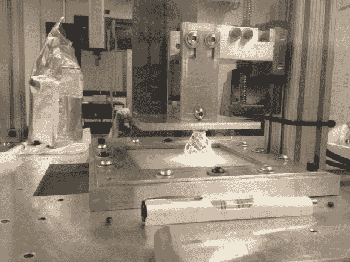

# 制造光固化树脂 3D 打印机所需的一切

> 原文：<https://hackaday.com/2013/03/06/everything-you-need-to-build-a-light-cured-resin-3d-printer/>

[Rachel Levine]是罗切斯特理工学院团队中的机械工程师之一，他建造了这台基于树脂的 3D 打印机。她写信来炫耀他们一直在做的了不起的工作。起初，他们的项目网站令人望而生畏，这并不奇怪，因为这里使用的概念相当先进。但是给自己几分钟的盲目点击，你会开始掌握这个神奇的工程的范围。坏消息是你不会在一个周末就把它做好。好消息是，如果你决定建立一个，这将会给你最大的背景，你需要让它发生。

钻机从构建平台上的软泥中拉出一个打印对象。他们使用可见光固化的树脂。这就是你在前景中看到关卡的原因；熔池需要有均匀的厚度，这样当光线从下面照射到它时，它就能正确固化。构建台由夹在垫圈之间的玻璃制成，垫圈与框架接触，使液体保持在适当的位置，同时让 DLP 投影仪照射进来。休息后，看看快速运动构建视频，看看每一层是如何暴露在光线下，然后向上拉，为下一层腾出空间。我们估计实时构建大约需要两个小时，您可以看到技术人员在此过程中定期更换提取的树脂。

基于 DLP 投影仪的打印机越来越受欢迎。查看去年的几个产品的[综述。](http://hackaday.com/2012/05/10/and-so-the-deluge-of-resin-based-3d-printers-begins/)

[https://www.youtube.com/embed/cYaUSvLKfp4?version=3&rel=1&showsearch=0&showinfo=1&iv_load_policy=1&fs=1&hl=en-US&autohide=2&wmode=transparent](https://www.youtube.com/embed/cYaUSvLKfp4?version=3&rel=1&showsearch=0&showinfo=1&iv_load_policy=1&fs=1&hl=en-US&autohide=2&wmode=transparent)