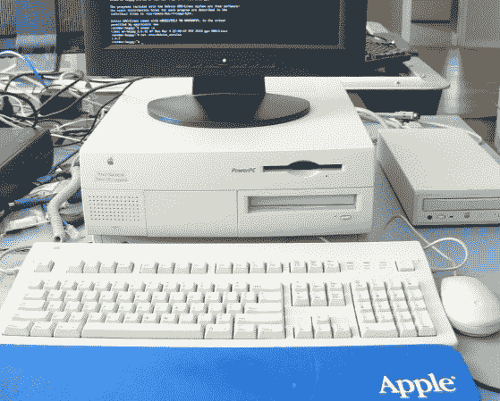

# PowerMac 7200 上的 Debian Linux

> 原文：<https://hackaday.com/2013/03/07/debian-linux-on-a-powermac-7200/>

我们这些在现代或接近现代的个人电脑上运行 Linux 的人都知道，它是一个功能强大的操作系统。它也非常容易安装在一台半现代的电脑上(至少对我来说是 Ubuntu)。在 90 年代中期的 PowerMac 7200 上，事情没有这么简单。

为了证明他的技术能力，甚至可能更证明他的坚韧，[Chris]能够让 Debian 6.07 在注定要毁灭的 PowerMac 上运行。他计划花几个小时升级这个 56 兆字节的庞然大物，但结果却是几天的事情。那些受过良好 Linux 教育的人可能会发现这些令人毛骨悚然的细节很有用，更多的背景知识可以在第一部分中找到。这个项目是通向其他项目的垫脚石，所以我们急于看到最终结果。

如果你觉得这很有趣，请随意查看我们网站的[复古版。它不完全是关于古代计算机的，但它有希望在一台计算机上显示出来。](http://retro.hackaday.com/ "retro hackaday")

经由[【推特】](https://twitter.com/ "Twitter")