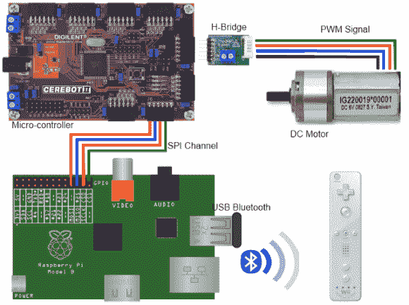

# Wiimote 控制的 RPi 机器人

> 原文：<https://hackaday.com/2013/03/07/wiimote-controlled-rpi-robot/>

[Brian]已经收集了强大的硬件来制造一个机器人。最终目标是拥有一个由 Wiimote 控制的[机器人。](http://www.brianhensley.net/2013/03/raspberry-pi-robot-wii-remote-phase-1.html "Raspberry Pi Wiimote Robot")

Wiimote 通过蓝牙与运行 Python 脚本的 Raspberry Pi 进行通信。这个脚本使用 CWiid Python 模块与控制器通信，并且[Brian]有关于让 [Wiimote 与 RPi](http://www.brianhensley.net/2012/08/wii-controller-raspberry-pi-python.html "Wiimote on Raspberry Pi") 一起工作的详细说明。RPi 通过 SPI 控制基于 ATmega 的开发板，开发板驱动 h 桥来控制移动机器人的两个 DC 电机。

[Brian]的代码对任何想用 Wiimote 控制 RPi 的人都有帮助。由于 Wiimotes 和 Bluetooth 加密狗现在相当便宜，这是一个无线控制任何 RPi 项目的好方法，甚至可以从沙发上控制你的媒体中心。

休息之后，请观看一段视频

[https://www.youtube.com/embed/zZPD0wcXPgw?version=3&rel=1&showsearch=0&showinfo=1&iv_load_policy=1&fs=1&hl=en-US&autohide=2&wmode=transparent](https://www.youtube.com/embed/zZPD0wcXPgw?version=3&rel=1&showsearch=0&showinfo=1&iv_load_policy=1&fs=1&hl=en-US&autohide=2&wmode=transparent)