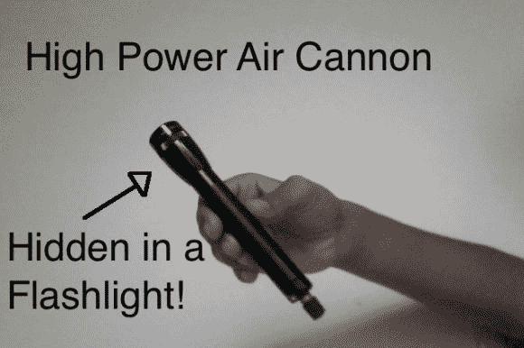

# 这种 Maglite 是 BB 枪

> 原文：<https://hackaday.com/2013/03/06/this-maglite-is-a-bb-gun/>

这个看起来天真无邪的 Maglite 内置一个活塞和枪管，使其成为一个功能性的[气动 BB 枪](http://www.instructables.com/id/Co-Axial-Pneumatic-BB-Gun/?ALLSTEPS "Pneumatic BB Gun")。选择 Maglite 是因为它具有很高的耐用性，并且易于接近内部。一个 schrader 阀伸出电池盖，允许枪使用标准配件充电。一根铜管被用作枪管，一个活塞控制射击。

开枪很简单。首先，整个东西被充到所需的压力。然后将弹药插入枪管。此时，橡胶活塞被枪中的压力保持在枪管的末端。通过推入阀销，活塞能够稍微向后移动。这就像扳机一样，使空气冲进枪管，点燃 BB。

结果相当令人印象深刻。使用计时器，BB 的速度被测量为每秒 850 英尺。使用[气枪设计工具](http://www.thehalls-in-bfe.com/GGDT/ "GGDT")模拟器，估计这种枪可以以超过每秒 1000 英尺的速度发射，甚至可能突破音障。