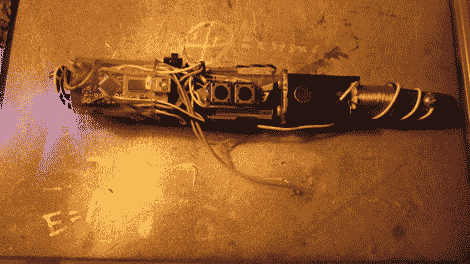

# 真正的多功能“声波螺丝刀”

> 原文：<https://hackaday.com/2013/03/07/real-multifunction-sonic-screwdriver/>

“我不懂，你没有技术。”好吧，所以它实际上并不是一个与热门电视剧《神秘博士》中的功能相同的未来工具，但[这个自制的“声波螺丝刀”](http://salviusrobot.blogspot.com/2012/12/diy-sonic-screwdriver.html) *是*一个多功能设备，尽管如此，它还是很酷。

围绕 Arduino Pro Mini 创建的，[Gunther]确实比我们展示的最后一款螺丝刀更胜一筹。内置功能包括:棕色音符音调发生器，狗哨子，电动势计，手电筒，红外通用遥控器，激光笔，欧姆表，声级计，电压检测器，电压表。如果你愿意，你也可以有一个电磁铁或输出电压源。如果这还不够，它甚至可以播放《星球大战》的主题曲！咻。这是一个满嘴的功能。

虽然他*已经*给[发布了 Arduino 代码](https://gist.github.com/gunthercox/4179931)，但是如果你想创建自己的代码，你必须关注他的网站以获取更多细节。他提到他正在制作蓝图和完整的零件清单…太棒了。开锁功能在哪里？

休息之后，请观看展示一些功能的视频。

【经[使](http://blog.makezine.com/)
使

[https://www.youtube.com/embed/zqc8fmZKMMI?version=3&rel=1&showsearch=0&showinfo=1&iv_load_policy=1&fs=1&hl=en-US&autohide=2&wmode=transparent](https://www.youtube.com/embed/zqc8fmZKMMI?version=3&rel=1&showsearch=0&showinfo=1&iv_load_policy=1&fs=1&hl=en-US&autohide=2&wmode=transparent)