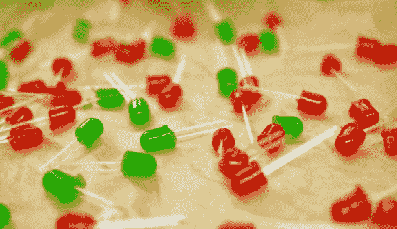

# 制造可食用发光二极管

> 原文：<https://hackaday.com/2013/03/07/fabricating-edible-leds/>

是的，它们是可以吃的。但是它们不亮。这对我们来说很好，因为[Becky Stern]用来制作这些软糖 led 的过程利用了几种你可以随身携带的技术。

在她的视频中显示的第一部分(在跳转后嵌入)是为糖果制作模具。你的零件箱里可能有几袋发光二极管。这些与泡沫芯制成的槽一起形成硅胶模具。在混合、浇注和硬化之后，[Becky]将 led 上的硅胶剥离，然后将其送入烤箱，使其可以安全食用。混合糖果使用简单的成分(明胶、水和抗坏血酸)，但你需要严格遵循方法来获得你习惯的味道和透明度。在添加使用 PLA 3D 打印的导线之前，注射器用于填充模具中的微小空隙。

这些将在你的下一次黑客空间会议上大受欢迎！

[https://www.youtube.com/embed/GszpCvlyNLo?version=3&rel=1&showsearch=0&showinfo=1&iv_load_policy=1&fs=1&hl=en-US&autohide=2&wmode=transparent](https://www.youtube.com/embed/GszpCvlyNLo?version=3&rel=1&showsearch=0&showinfo=1&iv_load_policy=1&fs=1&hl=en-US&autohide=2&wmode=transparent)

[图片:Johngineer]