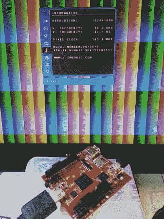

# 从 FPGA 中抽取 1080p 视频

> 原文：<https://hackaday.com/2013/03/08/pumping-1080p-video-out-of-an-fpga/>

[仓鼠]承认，这个针对 FPGA 的 1080p HDMI 黑客没有发出完全符合规格的信号。但正如你在上面的图像中看到的，它确实输出了 60 Hz 的 1920×1080 图像，这是全高清视频的大小和频率。由于一些抖动，它只是达不到要求，如果这仅用于早期原型制作，并且将在设计过程的后期被专用编码器取代，这可能是没问题的。

在这里，他选择了 Pipistrello 板，但认为任何具有 Spartan 6 芯片的设备都可以工作，该芯片的差分对连接到 HDMI 插座。这项任务的难点在于以 1500 Mb/s 的速度串行四个输出通道。因此，仅仅编码你的逻辑是行不通的。粗略完成设计后，[仓鼠]回去选择手动放置一些元件，以确保每个通道的数据同时到达。

当你在摆弄 HDMI 的时候，你可能也想[尝试一下这个叠加黑客](http://hackaday.com/2012/01/21/overlaying-video-on-encrypted-hdmi-connections/)。