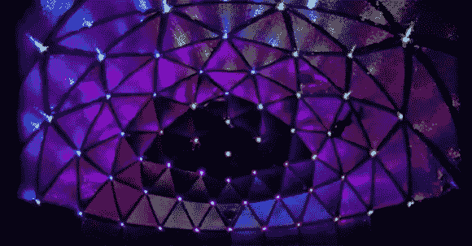

# 把自己放在一个展示中

> 原文：<https://hackaday.com/2013/03/08/putting-yourself-inside-a-display/>

这是一个有趣的建筑，它结合了光、声音和手势识别，创造了一个 360 度的光和声音环境。它被称为[钻头圆顶](http://www.zanecochran.com/bitdome/index.html)，虽然图片和视频非常酷，但我们确信它在现实生活中更令人印象深刻。

穹顶由一百多个泡沫隔热板制成的三角形构成，形成了一个直径 10 英尺、高 7 . 5 英尺的结构。这些面板的每个角落都有一个由 [Rainboduino](http://www.seeedstudio.com/depot/rainbowduino-led-driver-platform-plug-and-shine-p-371.html) 驱动的 RGB LED，后者又由连接到 Kinect 的计算机控制。

与圆顶互动的过程始于步入内部并激活校准过程。通过让用户将他们的手臂指向圆顶内的不同点，计算机可以可靠地告诉用户指向哪里，并在用户循环使用圆顶的功能时做出响应。

这个圆顶可以做很多事情，例如允许用户进行视听灯光秀，运行冥想程序，甚至玩蛇和吃豆人。休息之后，你可以在视频中查看这些游戏和更多内容。

[https://www.youtube.com/embed/9rvwq-BbXtM?version=3&rel=1&showsearch=0&showinfo=1&iv_load_policy=1&fs=1&hl=en-US&autohide=2&wmode=transparent](https://www.youtube.com/embed/9rvwq-BbXtM?version=3&rel=1&showsearch=0&showinfo=1&iv_load_policy=1&fs=1&hl=en-US&autohide=2&wmode=transparent)
[https://www.youtube.com/embed/R6Nr8g9t0Jo?version=3&rel=1&showsearch=0&showinfo=1&iv_load_policy=1&fs=1&hl=en-US&autohide=2&wmode=transparent](https://www.youtube.com/embed/R6Nr8g9t0Jo?version=3&rel=1&showsearch=0&showinfo=1&iv_load_policy=1&fs=1&hl=en-US&autohide=2&wmode=transparent)