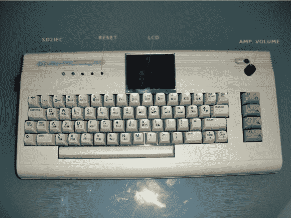

# 使 Commodore 64 便于携带

> 原文：<https://hackaday.com/2013/03/08/making-a-commodore-64-portable/>

这是[Wpqrek 的] [Commodore 64 改装的可以和他一起上路的](http://wpqrek.blogspot.com/2011/09/my-c64-mods.html)。这台老机器在他心中有一个特殊的位置，因为这是他学习编码的内容。他进行了一系列的破解，将使用机器所需的一切都装在原来的箱子里。

显然，对便携性影响最大的方法是将显示屏换成安装在数字键上方的小 LCD。这是一个非常简单的过程，因为最初用于车辆后视摄像头的屏幕已经有了复合视频输入。为了模拟软盘驱动器，他通过自己设计的 SD2iec 板使用 sd 卡。四舍五入的改变是一个立体声 SID。第二个通道使用从第二个 C64 切下的前置放大器电路。这个音频硬件可以让他做一些很酷的事情，比如播放一些经典的齐柏林飞艇。

休息之后你可以观看这些改动的视频。

[https://www.youtube.com/embed/dukfv1epVyY?version=3&rel=1&showsearch=0&showinfo=1&iv_load_policy=1&fs=1&hl=en-US&autohide=2&wmode=transparent](https://www.youtube.com/embed/dukfv1epVyY?version=3&rel=1&showsearch=0&showinfo=1&iv_load_policy=1&fs=1&hl=en-US&autohide=2&wmode=transparent)