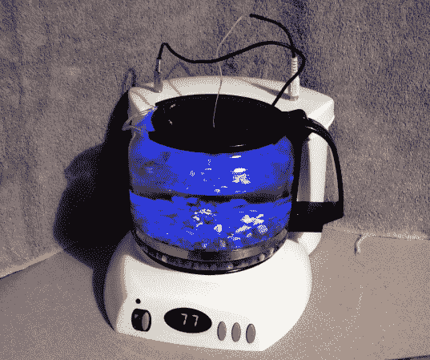

# 咖啡壶水族箱不用煮鱼就能保持鱼的温度(希望如此)

> 原文：<https://hackaday.com/2013/03/11/coffee-pot-aquarium-keeps-fish-warm-without-cooking-them-hopefully/>

贝塔鱼是最容易照顾的宠物之一。所以当[德里克]在情人节送他女朋友一个时，他认为任务完成了。事实证明，这些热带宠物需要 75-80 华氏度的水，而在冬天，当你把家里的恒温器保持在 60 度左右时，这种情况不会发生在一个普通的旧碗里。在寻找一个简单的加热解决方案时，他偶然想到了用一个便宜的滴滤咖啡机作为水族馆的想法。

两个主要组成部分已经到位:一个透明的玻璃水容器和一种加热方法。真正的诀窍是使用加热元件将水温和地加热到合适的温度。也许这个项目的关键是这个设备已经有了一个关闭加热元件的计时器。这意味着他的 MSP430 微控制器可以轻松控制，因为这意味着有一个继电器存在。他还接入了两个七段显示器，以向他反馈浸没在水中的 RL1003 热敏电阻当前读取的温度。你还会注意到，他在盖子上增加了几个发光二极管，让水族箱内部发光。