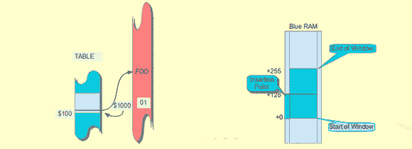

# 在 FPGAs 中构建新的奇怪的 CPU

> 原文：<https://hackaday.com/2013/03/11/building-new-weird-cpus-in-fpgas/>

FPGAs 在业余爱好者市场的普及不仅仅意味着定制 LED 控制器和经典计算机系统的克隆。FPGAs 也是试验计算机架构的一个很好的工具，创造出新的、奇怪的、不遵守业界使用了 40 年的惯例的 CPU。[Victor] [正在设计一种新的 CPU](http://www.fpgarelated.com/showarticle/44.php) ，它挑战了如何访问不同存储位置的传统，在这个过程中，它甚至想出了一些在 ARM 微控制器上运行的示例代码。

大多数时候，在你的台式机或笔记本电脑上运行的机器码并不那么有趣；只是要线性处理的长串指令。计算机的魔力来自于比较、if 语句或代码跳转，CPU 可以根据寄存器中的值运行两段代码中的一段。但是，有一个范围问题:如果一段代码直接调用另一段代码，新代码的地址必须在一条指令内。在 ARM 处理器上，只有 24 位可用于编码地址，这意味着代码跳转只能在其调用的任何一端进行 16 MB。更进一步需要更多的指令，随之而来的是性能下降。

[Victor]决定[这个问题的解决方案](http://www.fpgarelated.com/showarticle/45.php)是创建一点电路，作为存储地址位置的滑动窗口。代码中的每一个分支都被存储为相对于程序计数器中的任何内容的位置，而不是存储代码中跳转的文字地址。其结果是一种简单的 JMP 方法，可以在内存中很远的地方编码，而对性能的影响较小。

[Victor]为恩智浦的 ARM Cortex M3 微处理器开发了这种滑动窗口令牌的实现，他将在他的 git 上的新 CPU[中实现这一概念。](https://github.com/stacksmith/sliding-cpu)