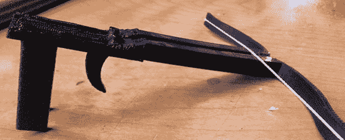

# 一体式 3D 打印弩

> 原文：<https://hackaday.com/2013/03/11/one-piece-3d-printed-crossbow/>

几个世纪前，各种工匠和铁匠花了数百个小时制作弩。从制作弓的精细工艺到绞盘所需的完美锻造，建造一台战争机器花费了大量的精力。由于[克里斯]有一台 3D 打印机，他认为他可以做得和这些已经去世很久的工匠一样好，并在一天之内制作出一把弩。

[克里斯]弩的真正有趣之处在于它只是一片塑料。弓被集成到枪托中，扳机通过一些创造性的 CAD 设计来工作，这些设计利用了塑料的可弯曲性。从这把弩上射出弩箭唯一需要的东西就是一根绳子。那个，还有几双筷子。

他不会参加任何围攻，但[克里斯]的武器不仅仅是能够射穿一个房间或发射一架轻木飞机。休息之后你可以看到一个例子。

[https://www.youtube.com/embed/T0hZ038-y1Y?version=3&rel=1&showsearch=0&showinfo=1&iv_load_policy=1&fs=1&hl=en-US&autohide=2&wmode=transparent](https://www.youtube.com/embed/T0hZ038-y1Y?version=3&rel=1&showsearch=0&showinfo=1&iv_load_policy=1&fs=1&hl=en-US&autohide=2&wmode=transparent)