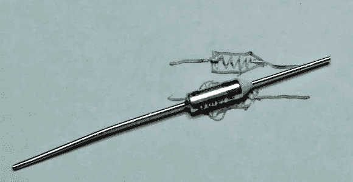

# 不可复位热保险丝拆卸

> 原文：<https://hackaday.com/2013/03/11/non-resettable-thermal-fuse-teardown/>

该组件是一次性热保险丝。当人体温度上升到规定温度以上时，两根导线停止传导。它们在电机等应用中很有用，在发生永久性损坏之前，您需要确保切断过热硬件的电源。它们非常简单，但由于有了[Fatkuh 的]视频，我们仍然很喜欢看一看的内部。

金属外壳衬有陶瓷绝缘体，你可以看到一端呈圆锥形伸出。它围绕着一个连接两个引线的弹簧，并承受着一点张力。制造连接的合金熔点低，在这种情况下大约为 70 摄氏度，它会熔化，使弹簧拉开并断开连接。在中断后的片段中,【Fatkuh】用他的烙铁将外壳加热到熔点以上，触发保险丝。然后他打开陶瓷锥，展示里面的东西。【T2

使用像这样的保险丝的唯一问题是，如果它跳闸了，你需要焊接一个新的元件。对于需要保护过电流(而不是过热)的保险丝的应用，[一个可复位的多保险丝](http://en.wikipedia.org/wiki/Resettable_fuse)是合适的选择。

[https://www.youtube.com/embed/Wq-R1egVKus?version=3&rel=1&showsearch=0&showinfo=1&iv_load_policy=1&fs=1&hl=en-US&autohide=2&wmode=transparent](https://www.youtube.com/embed/Wq-R1egVKus?version=3&rel=1&showsearch=0&showinfo=1&iv_load_policy=1&fs=1&hl=en-US&autohide=2&wmode=transparent)

[via [Reddit](http://www.reddit.com/r/electronics/comments/1a0ptg/a_quick_look_inside_a_thermal_fuse/)