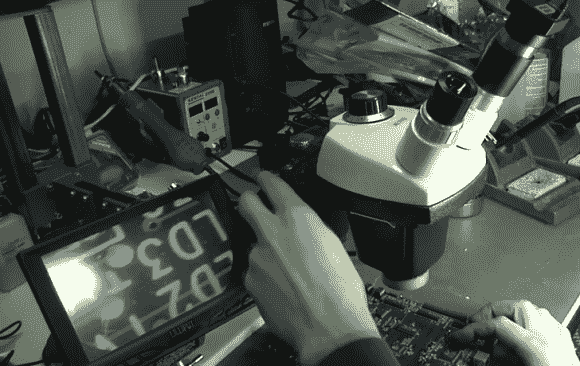

# 用于显微镜的摄像机适配器

> 原文：<https://hackaday.com/2013/03/12/camera-adapter-for-a-microscope/>

[Steve]在他的实验室里真的有一个很好的显微镜装置，因为他为他的立体显微镜做了一个摄像机适配器。上图显示的是电路板在它后面的液晶屏上的放大图。这让他可以在不需要通过目镜观察的情况下工作。这种黑客技术是对他为瞄准镜定制的[支架的完美补充。](http://hackaday.com/2013/02/20/the-perils-of-buying-a-stereo-microscope-without-a-stand/)

可以看到摄像机附件连接在瞄准镜的右镜头上。这是他手头已经有的一个旧的监控摄像头。普通镜头无法将照片聚焦，但他手头有一些不同的光学镜头，其中一个完全符合要求。项目的其余部分包括在他的车床上制造适配器环。它完美地套在目镜上，甚至允许他稍微调整一下焦距。休息后的视频中展示了这方面的最佳视角。

[https://www.youtube.com/embed/OtMiigagLSs?version=3&rel=1&showsearch=0&showinfo=1&iv_load_policy=1&fs=1&hl=en-US&autohide=2&wmode=transparent](https://www.youtube.com/embed/OtMiigagLSs?version=3&rel=1&showsearch=0&showinfo=1&iv_load_policy=1&fs=1&hl=en-US&autohide=2&wmode=transparent)