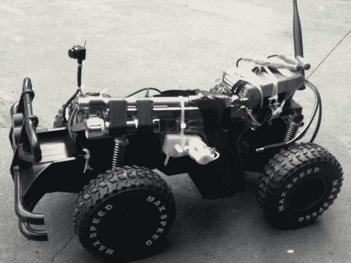

# 自带贝雷塔的遥控车

> 原文：<https://hackaday.com/2013/03/13/remote-control-car-that-packs-its-own-beretta/>

我们从来没有真正想过自己“这辆遥控车很有趣，但它真的需要更多的手枪”。如果我们这样做了，它肯定不会是一个与学生一起承担的建筑。但是人各有志。[Jerod Michel]是一位在中国工作的数学家。他最近和一群学生一起建立了这个项目。仔细看，你会注意到遥控车包括一个绑在侧面的遥控贝雷塔。

他没有关于这个项目的博客帖子，但是休息之后你可以找到一些图片和他的构建说明。枪支有一个连接到扳机的马达，允许它通过接入 RC 汽车 PCB 上的一个额外通道来发射。但你不会只是盲目开火。该项目还包括一个视频发射器，可以从安装在远程控制单元顶部的 LCD 屏幕上观看。甚至有一个激光瞄准器可以显示你的目标。

我们想知道火器的后坐力对这种轻型车辆有什么影响？

[构建指令](http://hosted.hackaday.com/robot_weapon.txt)(。txt 文件)

     