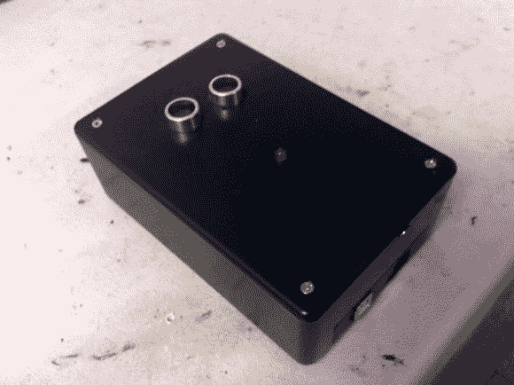

# 无触摸音乐播放器

> 原文：<https://hackaday.com/2013/03/13/no-touch-music-player/>

这个小盒子不仅能播放音乐，还能让你在不接触任何东西的情况下控制播放的几个方面。[Thomas Clauser]称之为 LighTouch，我们喜欢它，因为它使用听不见的声音来控制听得见的声音。

我们认为，这个项目外壳顶部伸出的一对圆柱体将被大多数读者视为超声波测距仪的商业终端。这是[托马斯]选择使用的唯一控制界面。虽然他没有详细描述他实施的具体控制方案，但他帖子中嵌入的视频显示了一些导致 Arduino 内部改变其行为的手势。例如，在较高水平上滑动手会开始回放，在较低水平上滑动会暂停回放。当调节音量时，盒子会根据他的手与传感器的距离做出反应。有了这种控制，这些事情的音乐方面就简单地由他使用的音乐屏蔽来处理。