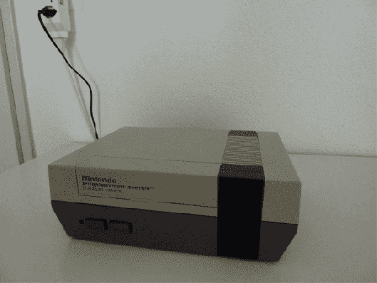

# 铰链 NES 案件隐藏了一个集成的液晶显示屏

> 原文：<https://hackaday.com/2013/03/12/hinged-nes-case-hides-an-integrated-lcd-screen/>

最近，我们确实看到了很多在项目中使用的原始 NES 案例。这一次，这个东西仍然播放原来的墨盒。这是[Maenggu]在将 LCD 屏幕与游戏控制台集成时为自己设定的主要目标之一。有一个展示该设备功能的快速视频剪辑。休息后会嵌入一些额外的图片。

在我们看来，当箱子合上时，NES 看起来完全没有修改过。盒式磁带插槽仍然接受游戏，但是一旦盒式磁带被插入，你不必降低框架到适当的位置。上图显示了连接构件上半部分和下半部分的带状电缆。它将 LCD 屏幕和盒式磁带适配器的信号传送到底座中的硬件。他提到他使用的是原装电源。我们不确定是否也使用原始主板，或者是否使用某种类型的仿真器。

[https://player.vimeo.com/video/61412267](https://player.vimeo.com/video/61412267)         