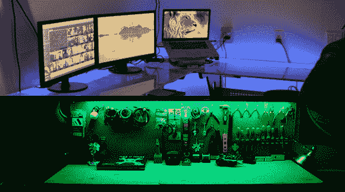

# 点亮工作空间一举两得

> 原文：<https://hackaday.com/2013/03/14/lighting-up-a-workspace-twofer/>

有时，两个极其相似的版本在几个小时之内就达到了 Hackaday tip 线。我们不是一个喜欢玩的人，所以这里有两个项目将 RGB LED 灯条放在桌子和工作台中。

[Charles]Makers work bench 一直需要一个照明解决方案来改善他的工作空间。荧光灯还不错，但是对于真正的极客信誉来说，除了 LED 灯以外，什么都不行。他在亚马逊上花 20 美元买了一个 RGB 条，现在他有了一个照明解决方案，可以改变他工作站上方的颜色。看看[他的 RGB 工作台狂欢视频](http://www.youtube.com/watch?feature=player_embedded&v=8LjUQlZgA20#!)。

电脑桌也是工作台，对吗？[威尔]有了让互联网上的人控制他桌子的灯光颜色的想法。他要求人们前往[这个网站](http://colormydesk.com/)，并要求人们为他的桌子安排一整天的颜色。Raspi 从服务器上提取每天的颜色。有了几个晶体管，一个 RGB 条，一个定制的盾牌，[伪造了三个 PWM 通道](http://mitchtech.net/raspberry-pi-pwm-rgb-led-strip)，【威尔】每天在他的办公桌上都有一种新的颜色。