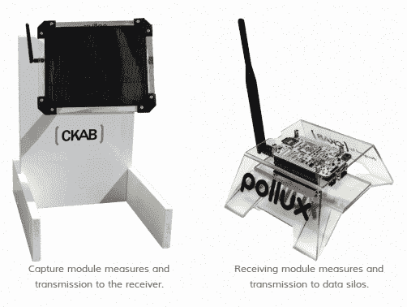

# 部署开源污染监控网络

> 原文：<https://hackaday.com/2013/03/15/deploying-an-open-source-pollution-monitoring-network/>

[Kasey]和[Guyzmo]在过去几年里一直在从事一个副业项目，让他们利用传感器网络监测污染。他们刚刚决定将这个项目开源，包括硬件和软件。该系统的细节可以在他们的 GitHub 库中找到。

该系统有两个主要组成部分。右边是从传感器阵列收集数据的基站，其中一个显示在左边。每个传感器都用电池供电，但配有一个光伏太阳能电池板，可以保持电源充足。它使用 Arduino 驱动系统，使用 XBee 无线电进行通信。关于传感器的一些信息可以在[摘要页面](https://github.com/hackable-devices/polluxnzcity/wiki)中找到。有一个 PM10 粒子污染传感器，温度，声音，氮气和氧气传感器。我们还想知道是否可以从太阳能电池板能够收集多少电能中收集到任何数据？

基站也使用 XBee 无线电来轮询网络，但它不是由 Arduino 驱动的。他们用基于 ARM 的 BeagleBone 来管理数据。