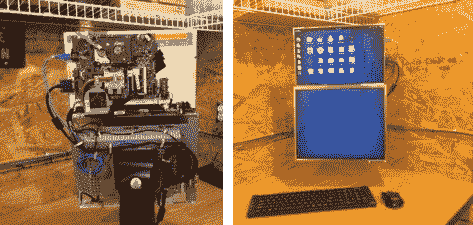

# 车间电脑漂浮在工作台上方，几乎是无线的

> 原文：<https://hackaday.com/2013/03/15/workshop-computer-floats-above-bench-and-is-nearly-wireless/>

[Ezra]用他手头的零件[组装了一台独立的双屏商店电脑](http://straypoetry.com/blog/projects/2013/02/dual-screen-vesa-mount-all-in-one-frankencomputer-hack/)。人们会给这样一个项目起什么名字呢？显然你会称它为弗兰克博士电脑。

较低的显示器是戴尔台式平板显示器。在原型制作期间，[Ezra]使用支架来支撑一切。但是为了保持他的工作空间整洁，最终版本被安装在他实验室角落的墙上。上面的显示屏是康柏笔记本电脑的液晶显示屏，他并没有使用。笔记本电脑仍然可以工作，我们相信这是 Fedora 系统的驱动力。安装在台式机屏幕内部框架上的支架支撑着笔记本电脑屏幕和主板。一个电源为一切供电，并连接到显示器后面墙上的插座上。键盘和鼠标是无线的，电脑与网络的连接也是无线的。

在我们自己的商店中，我们唯一担心的是木屑填充了散热器和主板的其他组件。也许他的实验室只是电子项目，或者他有一个防尘罩，在系统不使用时使用。