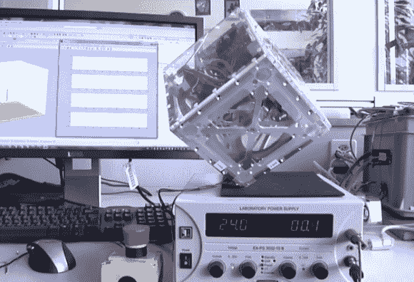

# 这个立方体是为行走而造的

> 原文：<https://hackaday.com/2013/03/14/this-cube-is-made-for-walkin/>

来看看 Cubli 吧，这是一个研究项目，旨在[制作一个不使用任何附属物就能四处行走的立方体](http://www.idsc.ethz.ch/Research_DAndrea/Cubli)。这是瑞士动力系统与控制研究所的一个研究项目。现在还有人在想我们亲爱的同伴魔方吗？

机器人实验是基于角动量的。立方体内部有安装在中心的马达，每个马达带动一个轮子旋转。其中三个相互垂直安装，使立方体能够沿任意轴改变位置。休息后的第一个视频最好地展示了这一点，其中仅展示了组件的一侧。正方形框架从静止位置开始。你看到轮子旋转起来，然后突然停下来，这导致轮子的动量将方形框架弹出到一个角上。然后，车轮切换到第二种模式，以保持平衡。最后一种模式是受控下落。从理论上讲，这将让立方体首尾相接地移动。到目前为止，他们还没有展示这种能力，但第二个演示视频确实显示了组装好的立方体在一个角上保持平衡。

[https://www.youtube.com/embed/KEVghOuZGDU?version=3&rel=1&showsearch=0&showinfo=1&iv_load_policy=1&fs=1&hl=en-US&autohide=2&wmode=transparent](https://www.youtube.com/embed/KEVghOuZGDU?version=3&rel=1&showsearch=0&showinfo=1&iv_load_policy=1&fs=1&hl=en-US&autohide=2&wmode=transparent)

[https://www.youtube.com/embed/S5-BmLsRemk?version=3&rel=1&showsearch=0&showinfo=1&iv_load_policy=1&fs=1&hl=en-US&autohide=2&wmode=transparent](https://www.youtube.com/embed/S5-BmLsRemk?version=3&rel=1&showsearch=0&showinfo=1&iv_load_policy=1&fs=1&hl=en-US&autohide=2&wmode=transparent)

[ [Reddit](http://www.reddit.com/r/gadgets/comments/1a82nl/cubli_a_cube_that_can_jump_up_balance_and_walk/) 通过 [Robohub](http://robohub.org/swiss-robots-cubli-a-cube-that-can-jump-up-balance-and-walk-across-your-desk/)