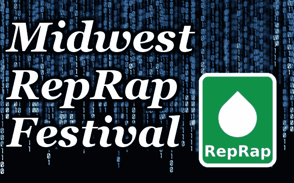

# 中西部说唱节

> 原文：<https://hackaday.com/2013/03/16/midwest-reprap-festival-2/>

我们是一个以美国为中心的网站，但除了在纽约或加州的活动，我们没有看到许多针对该国充满玉米和沃尔玛的地区的黑客、制造商或 3D 打印机活动。第一届一年一度的中西部说唱节旨在通过足够多的事件、演讲者和活动来改变这种情况，使印第安纳州的埃尔克哈特看起来像是一个充满希望的地方。

从官方上来说，这个节日是昨天开始的，但是今天的活动日程真的增加了。(Josef Prusa)将上台谈论 RepRap 的状况，许多 3d 打印供应商将在那里展示他们的产品，出售一些非常酷的东西。还有大量经验丰富的 RepRappers 可以帮助你调整你的机器到完美；还好，因为这个节日是为了创造同时打印最多 3D 打印机的世界纪录。

如果你在印第安纳北部，你可能想看看这个节日，给我们发几张照片或视频。