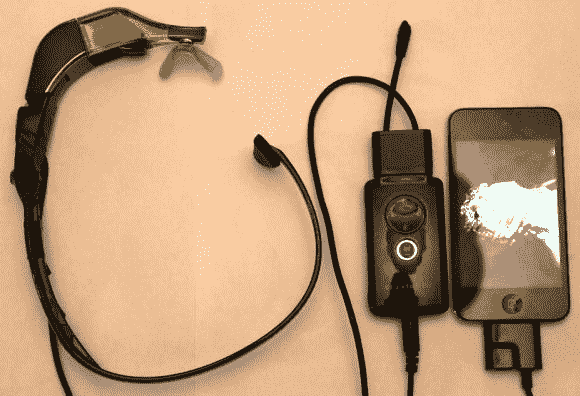

# 苹果粉丝现在可以使用谷歌眼镜了

> 原文：<https://hackaday.com/2013/03/17/google-glass-hack-for-apple-fanboys-can-be-had-right-now/>

如果你是苹果硬件的追随者，即将发布的谷歌眼镜可能不会让你太感兴趣。但是*概念*是普遍的酷。如果你想在[拥有一台运行 iOS](http://www.instructables.com/id/DIY-Google-Glasses-AKA-the-Beady-i) 的独眼声控电脑，那么这款电脑正适合你。[John]称它为 Beady-i，并发布了一篇逐步介绍他如何组装它的文章。

左边显示的是头盔。这是一副内置投影屏幕的眼镜和一个游戏耳机的组合。[John]切掉了一个镜片，并取下了眼镜的剩余部分。那只手臂被一个游戏耳机的框架取代，现在它缠绕在他的脖子后面，以确保不平衡的显示器不会脱落。

通过结合眼镜和耳机的电子设备，并用对接插头终止连接，他得到了他想要的东西。镜头显示屏幕上显示的内容，游戏耳机让他用一只耳朵听到设备的声音，并使用麦克风记录输入。