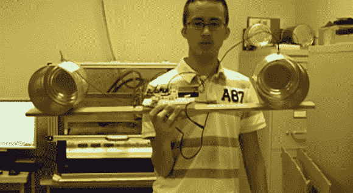

# 加州大学戴维斯分校的学生在麻省理工学院的启发下建造了咖啡罐雷达项目

> 原文：<https://hackaday.com/2013/03/18/uc-davis-students-build-coffee-can-radar-project-inspired-by-mit/>

闪烁的灯光很有趣，但是如果你正在获得一个电子工程学位，酷的东西会变得更加复杂。在这种情况下，建立自己的雷达是应该做的事情。加州大学戴维斯分校的一群学生展示了一个咖啡罐雷达装置。普通读者会认出这个概念是我们在 12 月看到的[。这个项目的灵感来自麻省理工学院的开放式课程项目。](http://hackaday.com/2012/12/18/build-a-360-synthetic-aperture-radar-with-mits-opencourseware)

其中一个罐子用作发射器，另一个用作收集器。这个装置的巧妙之处在于，分析是在 PC 上进行的，声卡作为采集设备。休息后的视频展示了硬件以及它收集的结果。大约一分半钟后，他们展示了一个实时演示，一名学生走到仪器前，另一名学生拍摄绘图结果的视频。当受试者离开受试者时，电脑图像会随之改变。视频的其余部分涵盖了一些工作原理和 pcb 组装。

[https://www.youtube.com/embed/VaTdotYE_dw?version=3&rel=1&showsearch=0&showinfo=1&iv_load_policy=1&fs=1&hl=en-US&autohide=2&wmode=transparent](https://www.youtube.com/embed/VaTdotYE_dw?version=3&rel=1&showsearch=0&showinfo=1&iv_load_policy=1&fs=1&hl=en-US&autohide=2&wmode=transparent)

[谢谢格雷戈里]