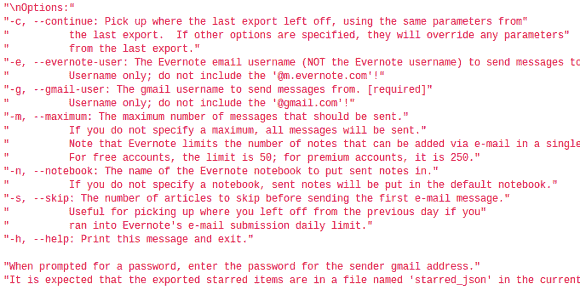

# Python 脚本从垂死的谷歌阅读器迁移到 Evernote

> 原文：<https://hackaday.com/2013/03/19/python-script-migrates-from-dying-google-reader-to-evernote/>

我们相信你已经听说谷歌已经决定关闭其名为谷歌阅读器的 RSS 聚合服务。我们必须记住，在它消失之前，从那里获取我们的数千个伟大的黑客博客订阅源列表。但是仅仅保存列表是相当容易的。[Paul Kerchen]有一点不同的问题。他有数百篇文章加了星，他想保留一种方法来再次找到那些页面。他的解决方案是编写自己的 [Python 脚本，将标有星号的谷歌阅读器文章迁移到 Evernote](https://github.com/kerchen/export_gr2evernote) 。

我们不是来推广 Evernote 服务的。但是，让我们在同一页上，这是一个归档系统，让您保存网页和文本文档等内容，以便在各种不同的平台上访问。因此，真正需要做的是[Paul]从他的 starred articles 文件夹中获取链接列表，并格式化以导入 Evernote。首先使用[谷歌外卖](https://www.google.com/takeout/)下载他的账户数据档案。在这个转储中有一个 JSON 格式的文件，名为“starred.json”。他的脚本解析数据并将每篇文章导入 Evernote。甚至有速率限制来管理免费账户的每日最大导入量。