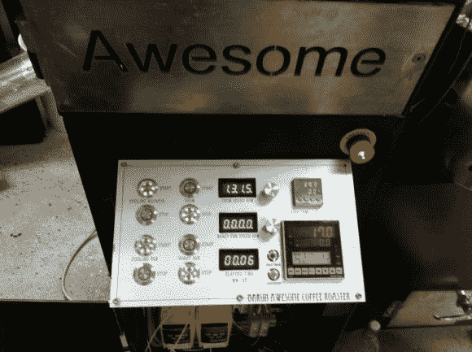

# 为商用咖啡烘焙机制作定制显示器

> 原文：<https://hackaday.com/2013/03/19/fabricating-custom-displays-for-a-commercial-coffee-roaster/>

烘焙完美的咖啡豆是一种艺术形式。但是，即使是最有才华的烘焙师也可以利用一点反馈来了解他们的设备。[Ludzinc]最近帮助了他的一个朋友，制作了这套 [7 段显示器来展示这个咖啡烘焙器](http://ludzinc.blogspot.com.au/2013/03/awesome-coffee.html)发生了什么。

隐藏在显示面板下方的黄色模块负责设置热风机的速度和滚筒转动的速率。它们可以使用一些微调按钮进行调整，但听起来像是除了直接观察之外，stock machine 不会给出任何类型的速度反馈。

解决方案是使用 PIC 芯片的 ADC 接入这些速度控制器。它们每个输出 0-10V，这是[Ludzinc]通过分压器测量的。速度量化后，微控制器输出到其中一个显示器。由于每个读数都有不同的芯片，固件可以定制以满足操作员的需求。

如果你仍然打算用洗衣机制作咖啡烘焙机，请记住这一点。