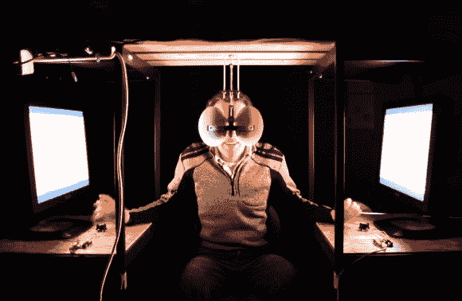

# 立体展示艺术装置

> 原文：<https://hackaday.com/2013/03/19/stereoscopic-display-art-installation/>

这个装置有点像博物馆或艺术装置，但这个概念非常简单，我们认为它可以很容易地启发你的下一个项目。两个镜子和两个视频源[组成了一个立体显示器](http://www.instructables.com/id/Interactive-stereoscopic-installations-visual-rup)。

用户坐在两个显示器之间(这里显示的是计算机显示器，但帖子也显示了投影在房间两面墙上的图像)。一对以 45 度角安装的镜子构成了目镜。这是一个 V 形镜子组件，其中窄端指向用户的鼻梁。镜子反射来自监视器的图像，为每只眼睛提供不同的视角。

在这种情况下，每个监视器都在回放一个视频循环，但其中一个只是比另一个稍微长一点。每个监视器前面都有一个电位计。用户可以加快或减慢播放速度，以使视频恢复同步。我们不认为我们会复制项目的这一部分。但是以这种方式观看一些立体剪辑可能会很有趣。甚至还有关于如何使用两台相机记录场景的说明。

在跳跃之后，您可以在剪辑中更近距离地观看测试仪器。

[https://www.youtube.com/embed/qdT83N003nI?version=3&rel=1&showsearch=0&showinfo=1&iv_load_policy=1&fs=1&hl=en-US&autohide=2&wmode=transparent](https://www.youtube.com/embed/qdT83N003nI?version=3&rel=1&showsearch=0&showinfo=1&iv_load_policy=1&fs=1&hl=en-US&autohide=2&wmode=transparent)