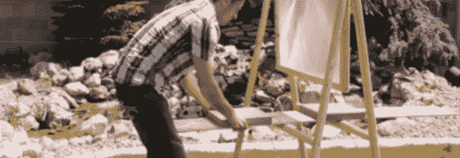
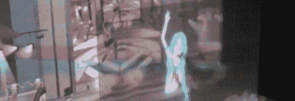
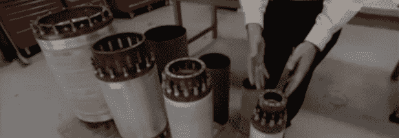
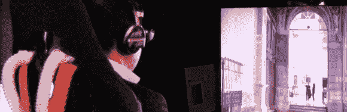
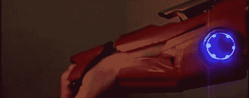

# 黑客日链接:2013 年 3 月 20 日

> 原文：<https://hackaday.com/2013/03/20/hackaday-links-march-20th-2013/>

#### 巨型菲涅尔透镜是危险的乐趣

#### 

对于 Craigslist 上经常免费列出的老式大屏幕电视来说，[有一个有趣但相当危险的用法。通过将旧电视的镜头安装到一个可调节的木框架中，[Grant]能够融化一堆硬币，立即燃烧木材，融化混凝土中的斑点，并为他的家人提供一个煮熟的鸡蛋……酷。](http://www.youtube.com/watch?feature=player_embedded&v=jrje73EyKag#!)

#### 投影映射应用程序帮助创建类似表演舞台的全息图

[Aimino]用一台 iPad、一台移动投影仪和一个蚊子屏幕[创造了一个类似舞台的迷幻全息图。](https://www.youtube.com/watch?v=CTS8rs6zUT4)乍一看，这似乎没什么，但实际上这是一个非常有趣的效果。观看视频让我想知道在不久的将来这还会有什么其他的应用。

#### 世界上最强的磁铁

造价超过 1400 万美元，重达 35 吨的 45 特斯拉混合动力车是地球上最强的 DC 磁铁。它是如此强大，以至于摄制组甚至不能安全地进去拍摄。他们一半以上的摄像机磁带在存放磁带的同一设施中就被擦除干净了！

#### 虚拟人体椅使用我们 5 种感官中的 4 种

东京都市大学的 Ikei 实验室希望为行动不便、无法再周游世界的老年人提供虚拟现实体验，并推出了“虚拟身体”展览。包括一个 3D 显示器，一副耳机，一个创造微风和传播气味的风扇，一个移动和振动的椅子，和移动的脚踏板。

#### 钢铁侠激光手套轻松戳破气球

如果你是一个有可支配收入的钢铁侠粉丝，你可能想看看这款功能齐全的全金属激光手套。没有蓝图或指南，从零开始建造，[AnselmoFanZero]以大约$3K 美元的价格出售。