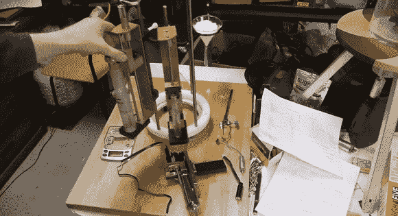

# 烘焙自动化混合单一饼干

> 原文：<https://hackaday.com/2013/03/20/bakery-automation-mixes-single-cookies/>

[本·克拉斯诺的]最新项目是一个美味的。上图中，他正在展示他的饼干分配器的雏形。不，这不是 T2 的另一种吃奥利奥饼干的方式。它实际上在生产链中出现得更早。他的设备类似于烘焙食品的 3D 打印机，因为它能够自动组合原料，形成小到一份饼干面团的生产流程。

当我们第一次听说它的时候，我们想知道为什么你只想烤一块饼干？但当然这根本不是目的。这台机器可以让你烤出一整片饼干，但是可以选择用不同的配方制作每一片饼干。和所有的烘焙一样，以适当的比例混合配料是最重要的。在顶部链接的帖子中，他正在制作黄油分配器。但是在更早的一篇文章中，他黑了一个电子秤来帮助称量其他成分。休息之后，您可以观看这两个视频剪辑。

想象一打面粉含量略有不同的饼干。几个测试表，他应该可以拨出最好的食谱。

[https://www.youtube.com/embed/c7caOKSBnr0?version=3&rel=1&showsearch=0&showinfo=1&iv_load_policy=1&fs=1&hl=en-US&autohide=2&wmode=transparent](https://www.youtube.com/embed/c7caOKSBnr0?version=3&rel=1&showsearch=0&showinfo=1&iv_load_policy=1&fs=1&hl=en-US&autohide=2&wmode=transparent)

[https://www.youtube.com/embed/N63IMoJmVOg?version=3&rel=1&showsearch=0&showinfo=1&iv_load_policy=1&fs=1&hl=en-US&autohide=2&wmode=transparent](https://www.youtube.com/embed/N63IMoJmVOg?version=3&rel=1&showsearch=0&showinfo=1&iv_load_policy=1&fs=1&hl=en-US&autohide=2&wmode=transparent)