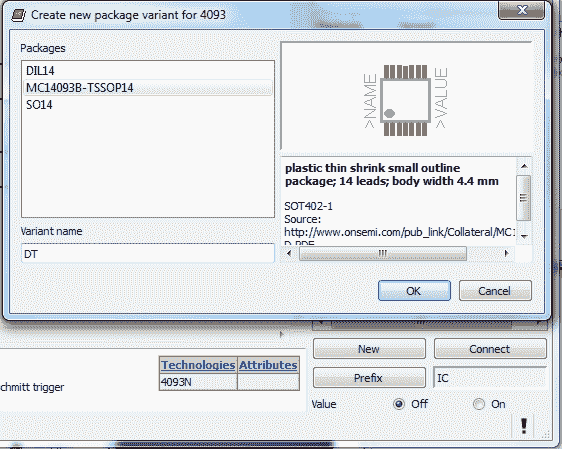

# 给 Eagle PCB 元件分配新封装

> 原文：<https://hackaday.com/2013/03/21/assigning-new-packages-to-eagle-pcb-components/>

如果你花了一些时间来设计你自己的电路板，我们肯定你遇到了在标准库中没有合适的元件或封装的问题。如果是普通零件，符号定义可能会在那里。但是也许您想要使用的足迹不见了？这是一个简单易懂的教程，演示了[如何将新的封装分配给现有的 Eagle PCB 组件](http://learn.adafruit.com/eagle-tutorial-how-to-add-a-new-package-to-a-component/)。它甚至展示了如何调整尺寸以满足您的需求的基础知识(比如使 SMD 尺寸更易于手工焊接)。

这不会教你如何制作你自己的定制符号，或者如何从头开始构建包。但是它可以让你从一个不同的组件中找到你想要使用的包，然后把它复制到你自己的库中，用于不同的部分。所展示的技术使这成为一个快速且相对无痛的过程。

我们当然不希望开始另一个评论泥潭一样[最近的 PIC 诉 AVR 讨论](http://hackaday.com/2013/03/10/another-salvo-in-the-pic-vs-avr-holy-war/)。但是我们广泛地使用了 Kicad 和 Eagle，感觉它们都没有以用户友好的方式真正掌握零件/封装外形的创建。我们喜欢 Kicad 将封装从元件中完全分离出来，它有无数的参数可以用来调整布局。但是，如果您经常使用相同的组件，Eagle 的链接部件和足迹的标准最终会节省大量时间。你怎么想呢?