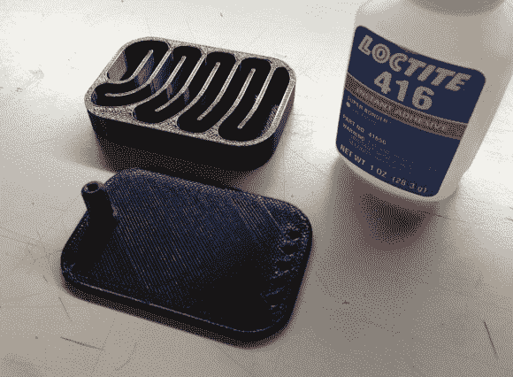

# 印刷真空泵消声器让实验室安静下来

> 原文：<https://hackaday.com/2013/03/21/printed-vacuum-pump-muffler-quiets-the-lab/>

[Joel]对他的店做了很好的改进。想想看，大多数人会听到很响的真空泵声，要么忍受它，要么戴上耳塞。但是[乔尔]听到一个响亮的真空泵声，心想:嘿，我能修好它！他的解决方案是[设计并印刷自己的消声器](http://jmillerid.com/wordpress/2013/03/vacuum-pump-muffler/)。

他对这个主题做了一些研究，发现设计的复杂性取决于应用程序。例如，你不希望过多地影响汽车排气的气流，否则你会因此而损失马力(和效率)。在这种情况下，产生所有噪音的真空泵具有相对较低的气流，因此这不是问题。他最终做的是设计一个挡板，通过迷宫般的通道来缓冲空气中的振动。最终结果从大约 92 dB 下降到 82 dB。这可能看起来不多，但是分贝测量不是线性的，所以它最终会产生很大的影响。休息过后，请在视频中亲自聆听。

[https://www.youtube.com/embed/vr3N5bwage4?version=3&rel=1&showsearch=0&showinfo=1&iv_load_policy=1&fs=1&hl=en-US&autohide=2&wmode=transparent](https://www.youtube.com/embed/vr3N5bwage4?version=3&rel=1&showsearch=0&showinfo=1&iv_load_policy=1&fs=1&hl=en-US&autohide=2&wmode=transparent)