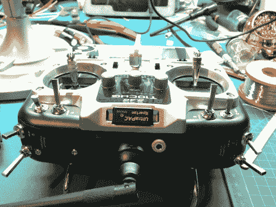

# 双叶 10C 无线电改装为 Spektrum 模块兼容性

> 原文：<https://hackaday.com/2013/03/21/futaba-10c-radio-modified-for-spektrum-module-compatibility/>

双叶 10C 电台(非模块版本)是[汤姆]的发射机的选择。不幸的是，它与他想要使用的 Spektrum DSM2 技术模块不兼容。所以，作为一个狡猾的家伙，[他决定破解它，所以它是](http://damage-designs.com/blog/2013/1/12/futaba-transmitter-mod-fly-e-flite-bind-and-flys.html)。

打开双叶发射器后，他意识到非模块版本的 10C 看起来和模块版本没什么不同。他的发射器只是在模块应该去的地方有一个硬连线的 pcb。他将一个 4 导体音频插孔焊接到发射机 pcb 上未使用的引脚上，然后用一些 J.B .焊缝将其安装在外壳中。然后，他在模块箱中布线并安装接收插孔。一根 6 英寸的小音频电缆将两个设备连接起来，velcro 将它们整齐地连接在一起。

他发现某些模块有问题，通道出现故障。除非有人破解了固件，否则无法重新映射控件。所以，有些模块就是不兼容。[Tom]休息之后，给了我们一个非常好的视频演示。看看这个。

[https://www.youtube.com/embed/nrqM1dVuX_8?version=3&rel=1&showsearch=0&showinfo=1&iv_load_policy=1&fs=1&hl=en-US&autohide=2&wmode=transparent](https://www.youtube.com/embed/nrqM1dVuX_8?version=3&rel=1&showsearch=0&showinfo=1&iv_load_policy=1&fs=1&hl=en-US&autohide=2&wmode=transparent)