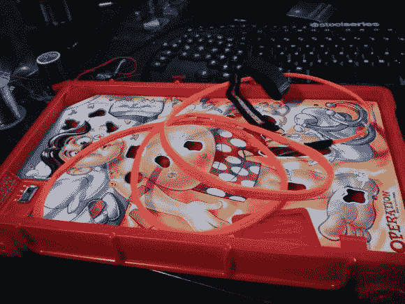

# 震撼的操作确保你在游戏中有皮肤

> 原文：<https://hackaday.com/2013/03/23/shocking-operation-makes-sure-you-have-skin-in-the-game/>

你小时候很可能玩过操作游戏。这个经典的电子玩具挑战你使用一个栓系的镊子来取出塑料碎片，而不接触它们隐藏的洞的侧面。对于成年观众来说，这次升级使挑战变得更加有趣。如果你触摸侧面，你不会听到不和谐的声音，你会得到一个痛苦的冲击！

修改从剪掉游戏中固定纸板面板的熔化塑料部分开始。从那里原始的电子设备被完全移除。我们认为这有点错误，因为我们仍然希望观众听到玩家受到电击时的声音。但是我们跑题了。一次性相机的电路板被修补到游戏中。腕带与你的身体形成电连接，如果你碰巧用镊子接触到侧面，它为相机的闪光灯电容器提供放电路径。

这篇文章遗漏了一个重要的东西:有人被电击的视频。[Psycosisnine]承诺很快会添加一些，但现在你只能依靠我们绝对喜欢的 [Mindflex shock 项目](http://hackaday.com/2010/03/04/using-mindflex-to-shock-the-heck-out-of-people/)。